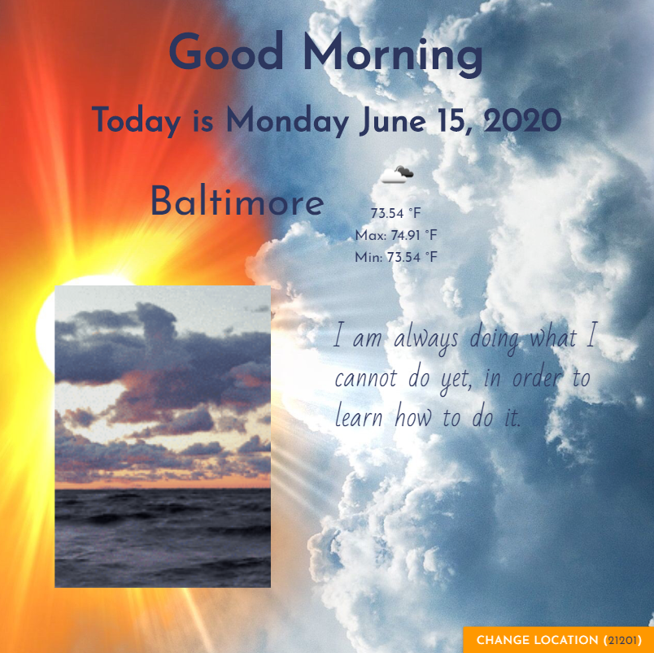

# Good Morning App

An uplifting app that greets the user with the date, the weather, a gif about the weather, and an inspirational quote.



## [Deployed App!](https://kendraneves.github.io/Good-Morning/)

## Getting Started

---

These instructions will get you a copy of the project up and running on your local machine for development and testing purposes. It will also give an overview of some of the app's functionality.

### Installing

Git clone the repository to your local machine:

HTTPS:

```
https://github.com/KendraNeves/Good-Morning.git
```

SSH:

```
git@github.com:KendraNeves/Good-Morning.git
```

There is no back-end to this project, so you just need to open index.html in the browser of your choice to get the application running.

## Built With

---

- JavaScript
- HTML
- CSS
- AJAX calls to REST APIs
- jQuery
- Bootstrap
- [Open Weather](https://openweathermap.org/api) API
- [Giphy](https://developers.giphy.com/) API
- [Quotes](https://rapidapi.com/martin.svoboda/api/quotes15) API

## Contributors

---

[](https://github.com/KendraNeves) |
[](mailto:kendraneves@gmail.com)

[](https://github.com/kdeguzm3) |
[](mailto:cosplaydiver@gmail.com)

To see a detailed breakdown of commits, click [here](https://github.com/KendraNeves/Good-Morning/graphs/contributors)

## User Story

AS a human

I WANT a webpage that will greet me in the morning, tell me the date, the weather, make me smile and feel inspired

SO THAT I can start my day with a positive attitude
